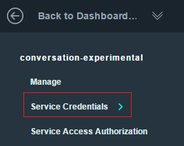
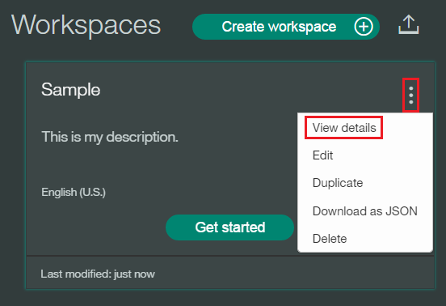

# Conversation Sample Application
[](http://travis-ci.org/watson-developer-cloud/conversation-simple)
[](https://codecov.io/github/watson-developer-cloud/conversation-simple?branch=master)

This Node.js application demonstrates how the Conversation service uses intent capabilities in a simple chat interface.

[See the application demo](http://conversation-simple.mybluemix.net/).

For more information about Conversation, see the [detailed documentation](http://www.ibm.com/watson/developercloud/doc/conversation/overview.shtml).

## How the application works
The application interface is designed and trained for chatting with a cognitive car. The chat interface is on the left, and the
JSON that the JavaScript code receives from the server is on the right. Your questions and commands are interpreted using a small set of sample data trained with intents like these:

    turn_on
    weather
    capabilities

These intents help the system to understand variations of questions and commands that you might submit.

Example commands that can be executed by the Conversation service are:

    turn on windshield wipers
    play music

If you type `Wipers on` or `I want to turn on the windshield wipers`, the system
understands that in both cases your intent is the same and responds accordingly.

# Deploying the application

There are two ways you can deploy the application:

 * [**Deploying on Bluemix.**](#bluemix) You can use the IBM Bluemix web interface to set up the Conversation service and deploy the application in the IBM cloud. No software prerequisites are required; both the Conversation service and the demo application run in the Bluemix environment. Use this method if you want to get your instance of the application up and running quickly. You can subsequently make changes to the application using the Bluemix web interface.

 * [**Deploying locally.**](#local) You can use command-line tools to set up the Conversation service in the IBM cloud and then deploy the application in a local runtime environment. To use this method, you must have Node.js and Cloud Foundry installed locally. Use this method if you want to host the application on your system, or if you want to modify the application locally before deploying it to the Bluemix cloud.

**Note:** Regardless of which method you choose, you must have a Bluemix account and run some steps using the Bluemix web interface.

<a name="bluemix">

## Before you begin

Make sure that you have a Bluemix account, and that your account has available space for at least 1 application and 1 service. To register for a Bluemix account, go to https://console.ng.bluemix.net/registration/. Your Bluemix console shows your available space:


## Deploying on Bluemix
</a>


### Deploy the App
1 Select Deploy to Bluemix.

&nbsp;&nbsp;&nbsp;&nbsp;&nbsp;&nbsp;&nbsp;&nbsp;&nbsp;&nbsp;&nbsp;&nbsp; [](https://bluemix.net/deploy?repository=https://github.com/watson-developer-cloud/conversation-simple)

2 Log in with an existing Bluemix account or sign up.

3 Name your app and select your REGION, ORGINIZATION, and SPACE. Then select DEPLOY.
&nbsp;&nbsp;&nbsp;&nbsp;&nbsp;&nbsp;&nbsp;&nbsp;&nbsp;&nbsp;&nbsp;&nbsp; 

* This performs two actions:
  - Creates the app
  - Creates a Conversation service instance that the user needs for workspace creation

* The status of the deployment is shown. This can take some time.

&nbsp;&nbsp;&nbsp;&nbsp;&nbsp;&nbsp;&nbsp;&nbsp;&nbsp;&nbsp;&nbsp;&nbsp;

4 Once your app has deployed, select VIEW YOUR APP.

&nbsp;&nbsp;&nbsp;&nbsp;&nbsp;&nbsp;&nbsp;&nbsp;&nbsp;&nbsp;&nbsp;&nbsp;

<a name="returnbluemix">
5 Navigate to your Bluemix Dashboard and [import a workspace](#workspace). Setup your workspace then <b>return to these steps</b>.
</a>

6 After you have set up a workspace, [add the WORKSPACE_ID environment variable](#env).

<a name="usingCloudfoundry">
### Using Cloudfoundry CLI tool to deploy your application
</a>

To build the application:

1 Download and install the [Cloudfoundry CLI](https://github.com/cloudfoundry/cli) tool.

2 Git clone the project `https://github.com/watson-developer-cloud/conversation-simple`

3 Navigate to the `conversation-simple` folder

4 Connect to Bluemix in the command-line tool:

 For US Region

 ```sh

 $ cf api https://api.ng.bluemix.net

 ```

 ```sh

 $ cf login -u <your user ID>

 ```

5 Create the Conversation service in Bluemix:

 ```sh

 $ cf create-service conversation free conversation-service

 ```

6 Push it live:

 ```sh

 $ cf push <application-name>

 ```
 The name you use determinates your application URL initially, such as `<application-name>.mybluemix.net`.

<a name="local">
## Deploying locally
</a>


<a name="returnlocal">
2 In Bluemix, [create a Conversation Service](http://www.ibm.com/watson/developercloud/doc/conversation/convo_getstart.shtml).
- [Import a workspace](#workspace)
- Copy the [Service Credentials](#credentials) for later use.
- <b>Return to these steps</b>
</a>

### Running locally

  The application uses [Node.js](http://nodejs.org/) and [npm](https://www.npmjs.com/).

1 Copy the credentials from your `conversation-service` service in Bluemix to a `.env` file in the root.

2 Use the Conversation tooling app to [import a workspace](#workspace) and add the workspace ID environment variable to the `.env` file. For details about obtaining the workspace ID, see Step 5 in the workspace section.

3 Install [Node.js](http://nodejs.org/).

4 Open the terminal, go to the project folder, and run this command:
    ```
    npm install
    ```

5  Start the application by running this command:
    ```
    npm start
    ```

6 Open `http://localhost:3000` in a browser.

_Note: If you are interested in deploying you local application or the changes you have made locally to Bluemix, go to [this section](#usingCloudfoundry)_

<a name="credentials">
### Service Credentials
</a>

1 Go to the Bluemix Dashboard and select the Conversation service instance. Once there, select the **Service Credentials** menu item.

&nbsp;&nbsp;&nbsp;&nbsp;&nbsp;&nbsp;&nbsp;&nbsp;&nbsp;&nbsp;&nbsp;&nbsp;

2 Select **ADD CREDENTIALS**. Name your credentials then select **ADD**.

3 Copy the credentials (or remember this location) for later use.


<a name="workspace">
### Import a workspace
</a>

To use the app you're creating, you need to add a worksapce to your Conversation service. A workspace is a container for all the artifacts that define the behavior of your service (ie: intents, entities and chat flows). For this sample app, a workspace is provided.

For more information on workspaces, see the full  [Conversation service  documentation](https://www.ibm.com/smarterplanet/us/en/ibmwatson/developercloud/doc/conversation/overview.shtml).

1 Navigate to the Bluemix dashboard, select the Conversation service that you created.

2 Go to the **Manage** menu item and select **Launch Tool**. This opens a new tab in your browser, where you are prompted to login if you have not done so before. Use your Bluemix credentials.

3 If you are deploying through Bluemix, download the [exported JSON file](https://raw.githubusercontent.com/watson-developer-cloud/conversation-simple/master/training/car_workspace.json) that contains the Workspace contents. If deploying locally,  this was cloned and is in the training folder (training/car_workspace.json).

4 Select the import icon: . Browse to (or drag and drop) the JSON file. Choose to import **Everything(Intents, Entities, and Dialog)**. Then select **Import** to finish importing the workspace.

5 Refresh your browser. A new workspace tile is created within the tooling. Select the _menu_ button within the workspace tile, then select **View details**:

&nbsp;&nbsp;&nbsp;&nbsp;&nbsp;&nbsp;&nbsp;&nbsp;&nbsp;&nbsp;&nbsp;&nbsp;

<a name="workspaceID">
In the Details UI, copy the 36 character UNID **ID** field. This is the **Workspace ID**.
</a>

&nbsp;&nbsp;&nbsp;&nbsp;&nbsp;&nbsp;&nbsp;&nbsp;&nbsp;&nbsp;&nbsp;&nbsp; 

6 Return to the deploy steps that you were following:
- For Local - [return to step 2](#returnlocal)
- For Bluemix - [return to step 5](#returnbluemix)

<a name="env">
### Adding environment variables in Bluemix
</a>

1 In Bluemix, open the application from the Dashboard. Select **Environment Variables**.

2 Select **USER-DEFINED**.

3 Select **ADD**.

4 Add a variable with the name **WORKSPACE_ID**. For the value, paste in the Workspace ID you [copied earlier](#workspaceID). Select **SAVE**.

&nbsp;&nbsp;&nbsp;&nbsp;&nbsp;&nbsp;&nbsp;&nbsp;&nbsp;&nbsp;&nbsp;&nbsp;

5 Restart your application.


# Troubleshooting in Bluemix

#### In the Classic Experience:
- Log in to Bluemix, you'll be taken to the dashboard.
- Navigate to the the application you previously created.
- Select **Logs**.

&nbsp;&nbsp;&nbsp;&nbsp;&nbsp;&nbsp;&nbsp;&nbsp;&nbsp;&nbsp;&nbsp;&nbsp;

- If you want, filter the LOG TYPE by "APP".

&nbsp;&nbsp;&nbsp;&nbsp;&nbsp;&nbsp;&nbsp;&nbsp;&nbsp;&nbsp;&nbsp;&nbsp;

#### In the new Bluemix:
- Log in to Bluemix, you'll be taken to the dashboard.
- Select **Compute**

&nbsp;&nbsp;&nbsp;&nbsp;&nbsp;&nbsp;&nbsp;&nbsp;&nbsp;&nbsp;&nbsp;&nbsp;

- Select the application you previously created.
- Select **Logs**.

&nbsp;&nbsp;&nbsp;&nbsp;&nbsp;&nbsp;&nbsp;&nbsp;&nbsp;&nbsp;&nbsp;&nbsp;

- If you want, filter the Log Type by selecting the drop-down and selecting **Application(APP)**.

&nbsp;&nbsp;&nbsp;&nbsp;&nbsp;&nbsp;&nbsp;&nbsp;&nbsp;&nbsp;&nbsp;&nbsp;

# Troubleshooting with CLI

To see the logs, run the command

`$ cf logs < application-name > --recent`

# License

  This sample code is licensed under Apache 2.0.
  Full license text is available in [LICENSE](LICENSE).

# Contributing

  See [CONTRIBUTING](CONTRIBUTING.md).


## Open Source @ IBM

  Find more open source projects on the
  [IBM Github Page](http://ibm.github.io/).
