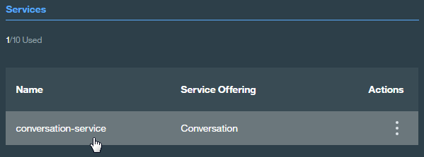
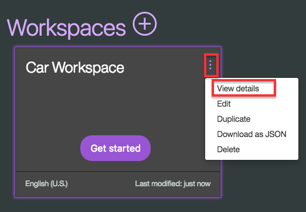

# Conversation Sample Application
[](http://travis-ci.org/watson-developer-cloud/conversation-simple)
[](https://codecov.io/github/watson-developer-cloud/conversation-simple?branch=master)

This Node.js application demonstrates how the Conversation service uses intent capabilities in a simple chat interface.

[See the application demo](http://conversation-simple.mybluemix.net/).

For more information about Conversation, see the [detailed documentation](http://www.ibm.com/watson/developercloud/doc/conversation/overview.shtml).

## How the application works
The application interface is designed and trained for chatting with a cognitive car. The chat interface is on the left, and the
JSON that the JavaScript code receives from the server is on the right. Your questions and commands are interpreted using a small set of sample data trained with intents like these:

    turn_on
    weather
    capabilities

These intents help the system to understand variations of questions and commands that you might submit.

Example commands that can be executed by the Conversation service are:

    turn on windshield wipers
    play music

If you type `Wipers on` or `I want to turn on the windshield wipers`, the system
understands that in both cases your intent is the same and responds accordingly.

# Deploying the application

You can use command-line tools to set up the Conversation service in the IBM cloud and then deploy the application code in a local runtime environment. To use this method, you must have Node.js and Cloud Foundry installed locally. Use this method if you want to host the application on your system, or if you want to modify the application locally before deploying it to the Bluemix cloud.

## Before you begin

* You must have a Bluemix account, and your account must have available space for at least 1 application and 1 service. To register for a Bluemix account, go to https://console.ng.bluemix.net/registration/. Your Bluemix console shows your available space.

* You must have the following prerequisites installed:
  * the [Node.js](http://nodejs.org/) runtime (including the npm package manager)
  * the [Cloud Foundry command-line client](https://github.com/cloudfoundry/cli#downloads)

## Getting the files

1. Download the application code to your computer. You can do this in either of the following ways:

   * [Download the .zip file](https://github.com/watson-developer-cloud/conversation-simple/archive/master.zip) of the GitHub repository and extract the files to a local directory
   
   * Use GitHub to clone the repository locally
   
1. At the command line, go to the local project directory (`conversation-simple`).

## Setting up the Conversation service

1. Make sure you have logged in to your Bluemix account using Cloud Foundry. For more information, see [the Watson Developer Cloud documentation](https://www.ibm.com/watson/developercloud/doc/getting_started/gs-cf.shtml).

1. Create an instance of the Conversation service in the IBM cloud:

   ```bash
   cf create-service Conversation <service_plan> <service_instance>
   ```
   
   For example:
   
   ```bash
   cf create-service Conversation free conversation-simple-demo-test1
   ```

1. Create a service key:

   ```bash
   cf create-service-key <service_instance> <service_key>
   ```
   
   For example:

   ```bash
   cf create-service-key conversation-simple-demo-test1 conversation-simple-demo-test1-key1
   ```

### Importing the Conversation workspace

1. In your browser, navigate to your Bluemix console.

1. From the **All Items** tab, click the newly created Conversation service in the **Services** list.

   

   The Service Details page opens.

1. Click **Launch tool**. 

   

   The Conversation service tool opens.

1. Click **Import**. When prompted, specify the location of the workspace JSON file in your local copy of the application project:

   `<project_root>/training/car_workspace.json`

1. Select **Everything (Intents, Entities, and Dialog)** and then click **Import**. The car dashboard workspace is created.

## Configuring the application environmnet

1. Copy the `.env.example` file to a new `.env` file. Open this file in a text editor.

1. Retrieve the credentials from the service key:

   ```bash
   cf service-key <service_instance> <service_key>
   ```
   
   For example:

   ```bash
   cf service-key conversation-simple-demo-test1 conversation-simple-demo-test1-key1
   ```

   The output from this command is a JSON object, as in this example:

   ```javascript
   {
     "password": "87iT7aqpvU7l",
     "url": "https://gateway.watsonplatform.net/conversation/api",
     "username": "ca2905e6-7b5d-4408-9192-e4d54d83e604"
   }
   ```

1. In the JSON output, find the values for the `password` and `username` keys. Paste these values (not including the quotation marks) into the `CONVERSATION_PASSWORD` and `CONVERSATION_USERNAME` variables in the `.env` file:
   
   ```
   CONVERSATION_USERNAME=ca2905e6-7b5d-4408-9192-e4d54d83e604
   CONVERSATION_PASSWORD=87iT7aqpvU7l
   ```

   Leave the `.env` file open in your text editor.

1. In your Bluemix console, open the Conversation service instance where you imported the workspace.

1. Click the menu icon in the upper right corner of the workspace tile, and then select **View details**.

   
   
   The tile shows the workspace details.
   
1. Click the  icon to copy the workspace ID to the clipboard.

1. On the local system, paste the workspace ID into the WORKSPACE_ID variable in the `.env` file. Save and close the file.

1. Install the demo application package into the local Node.js runtime environment:
   
   ```bash
   npm install
   ```

1. Start the application:

    ```bash
    npm start
    ```

The application is now deployed and running on the local system. Go to `http://localhost:3000` in your browser to try it out.

## Optional: Deploying from the local system to Bluemix

If you want to subsequently deploy your local version of the application to the Bluemix cloud, you can use Cloud Foundry to do so.

1. In the project root directory, open the `manifest.yml` file in a text editor.

1. Specify the following values in the file:

   * In the `applications` section of the `manifest.yml` file, change the `name` value to a unique name for your version of the demo application.
   
   * In the `services` section, specify the name of the Conversation service instance you created for the demo application. If you do not remember the service name, use the `cf services` command to list all services you have created.
   
   * In the `env` section, add the `WORKSPACE_ID` environment variable, specifying the value from the `.env` file.
   
   The following example shows a modified `manifest.yml` file:   

   ```YAML
   ---
   declared-services:
     conversation-service:
       label: conversation
       plan: free
   applications:
   - name: conversation-simple-app-test1
     command: npm start
     path: .
     memory: 256M
     instances: 1
     services:
     - conversation-simple-demo-test1
     env:
       NPM_CONFIG_PRODUCTION: false
       WORKSPACE_ID: fdeab5e4-0ebe-4183-8d10-6e5557a6d842
    ```
   
1. Save and close the `manifest.yml` file.

1. Push the application to Bluemix:

   ```bash
   cf push
   ```

When the command finishes processing, your application is deployed and running on Bluemix. You can access it using the URL specified in the command output.

# Troubleshooting

If you encounter a problem, you can check the logs for more information. To see the logs, run the `cf logs` command:

   ```bash
   cf logs <application-name> --recent
   ```

# License

  This sample code is licensed under Apache 2.0.
  Full license text is available in [LICENSE](LICENSE).

# Contributing

  See [CONTRIBUTING](CONTRIBUTING.md).

## Open Source @ IBM

  Find more open source projects on the
  [IBM Github Page](http://ibm.github.io/).
